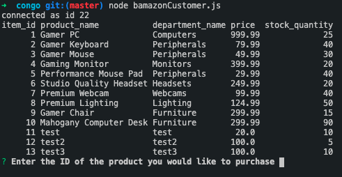
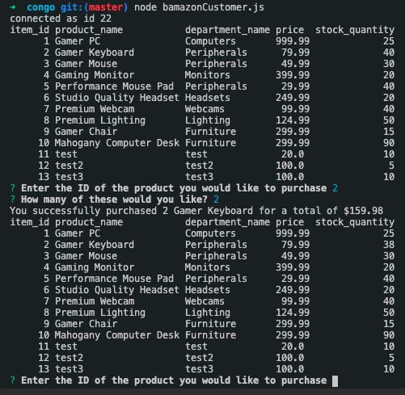

# congo
# Name
congo

# Description
Congo is a commandline utility that allows users to view the inventory of the Congo retailer and make purchases directly.

# Visuals
After entering the command "node bamazonCustomer.js" this prompt appears:
 

After an id is selected, this second prompt appears:
 

Next the user enters how many of that particular item they want to purchase. They are then shown the number entered and the total cost for them. The menu is displayed again and the user can then make another purchase if they would like:
 

# [Node](https://nodejs.org/en/) Packages Used
  - [dotenv](https://www.npmjs.com/package/dotenv)
  - [inquirer](https://www.npmjs.com/package/inquirer)
  - [list-it](https://www.npmjs.com/package/list-it)
  - [mysql](https://www.npmjs.com/package/mysql)
